# Windows Terminals

This repository is meant to aggregate some of the best Windows Terminal themes, with all their definitions and color schemes. Feel free to create a new pull request with your favorite theme.

## Motivation

This amazing [Reddit thread](https://www.reddit.com/r/Windows10/comments/gnqw1y/can_we_show_off_our_new_terminals/) gave me the inspiration to compile these beautiful themes.

## Resources

- [Oh my posh](https://github.com/JanDeDobbeleer/oh-my-posh)
- [Cascadia Code Font](https://docs.microsoft.com/en-us/windows/terminal/cascadia-code)
- [Scott Hanselman tutorial](https://www.hanselman.com/blog/HowToMakeAPrettyPromptInWindowsTerminalWithPowerlineNerdFontsCascadiaCodeWSLAndOhmyposh.aspx)
- [Nerd fonts](https://github.com/ryanoasis/nerd-fonts/)

## Notes

If you ever find reference to `ms-appdata:///roaming` for Windows Terminal, that's translated into:

```shell
%LOCALAPPDATA%\Packages\Microsoft.WindowsTerminal_8wekyb3d8bbwe\RoamingState
```

You can try this out by hit Win+R following the path above. This will be the local user roaming data for Windows Terminal.

I'll try to aggregate the fonts as much as possible in the [fonts](fonts/) folder.

## Themes

Here you can find a list of themes, how they look like and you have a small link under each one for the details, where you have all the information needed to set up in your local machine.

### Middle Machine

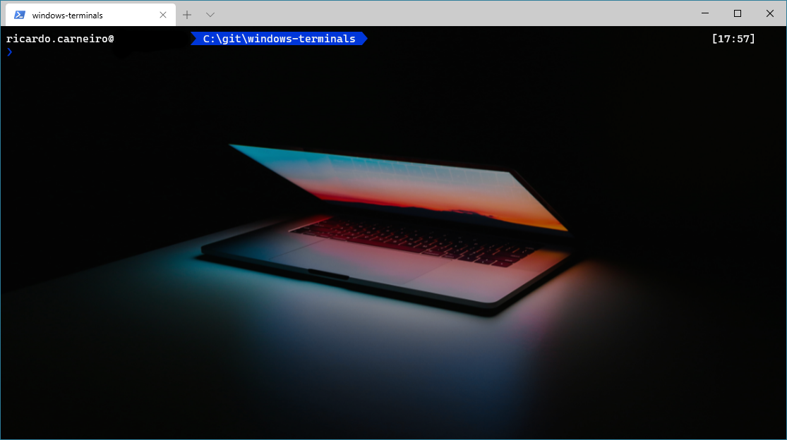

> Details: [Middle-Machine](themes/Middle-Machine.md)

### Kayla Cinnamon on MSBuild

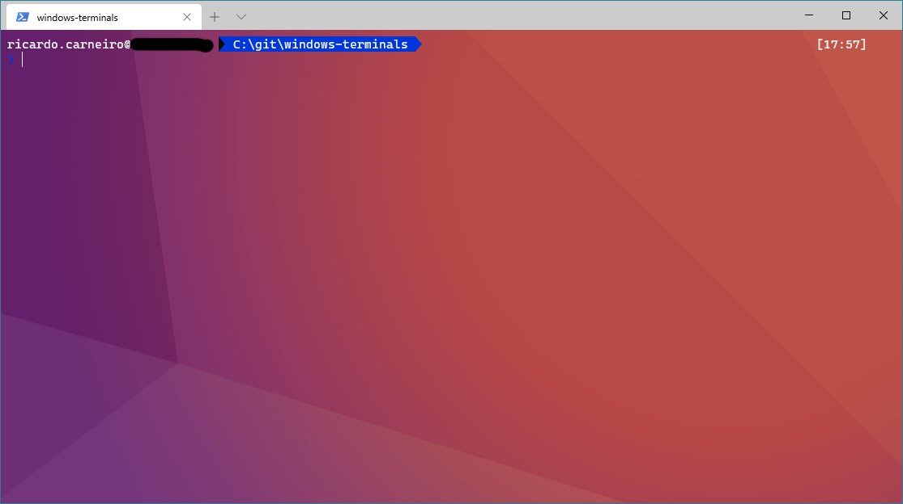

> Details: [Kayla Cinnamon on MSBuild](themes/kayla-cinnamon-on-msbuild.md)  
> Reference: https://twitter.com/cinnamon_msft/status/1263447505636753408

### Hackerman

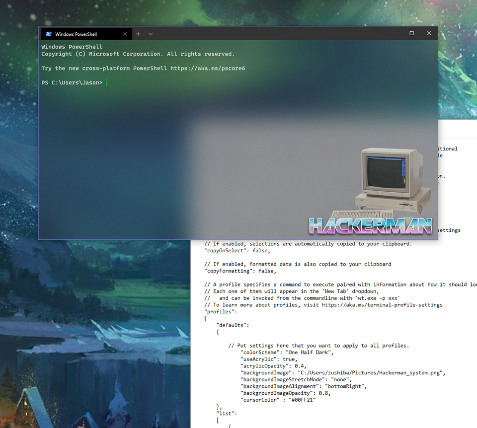

> Details: [Hackerman](themes/hackerman.md)  
> Reference: https://www.reddit.com/r/Windows10/comments/gnqw1y/can_we_show_off_our_new_terminals/

### Aperture Science

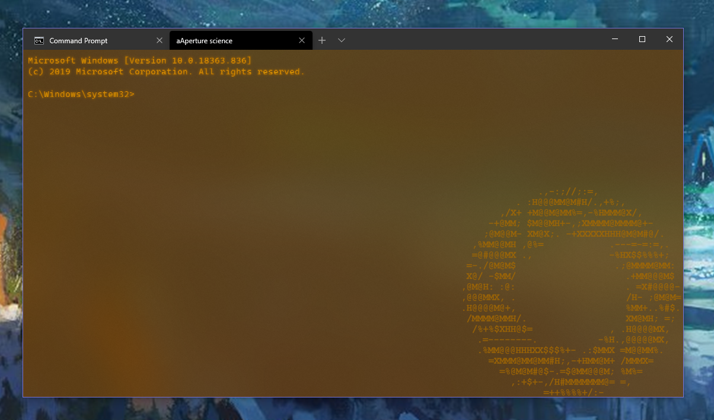

> Details: [Aperture Science](themes/Aperture-Science.md)  
> Reference: https://www.reddit.com/r/Windows10/comments/gnqw1y/can_we_show_off_our_new_terminals/frbtg2k

### Detroit Become Human

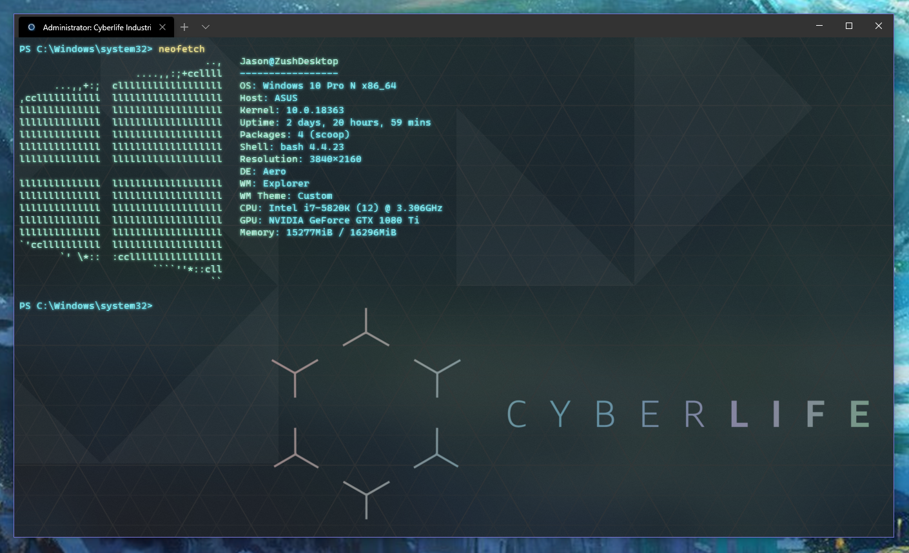

> Details: [Detroit Become Human](themes/detroit-become-human.md)  
> Reference: https://www.reddit.com/r/Windows10/comments/gnqw1y/can_we_show_off_our_new_terminals/fres7dx/

### Dark+

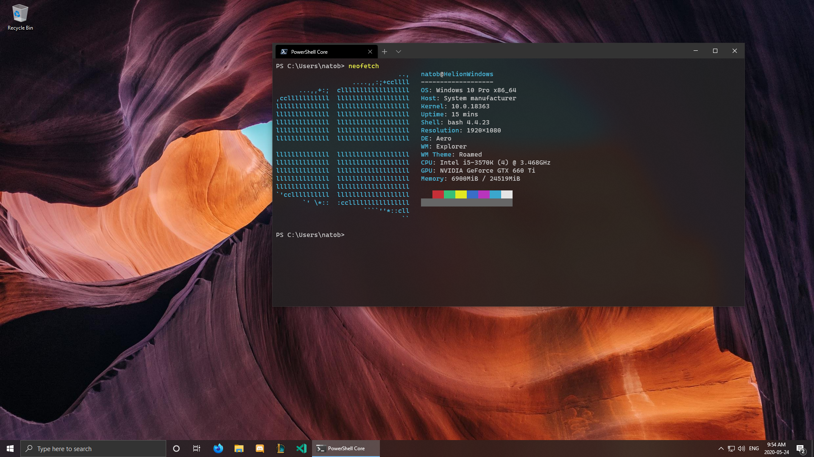

> Details: [Dark+](themes/dark-plus.md)  
> Reference: https://www.reddit.com/r/Windows10/comments/gpqbk7/vscodes_theme_dark_is_absolutely_gorgeous/

### Nord

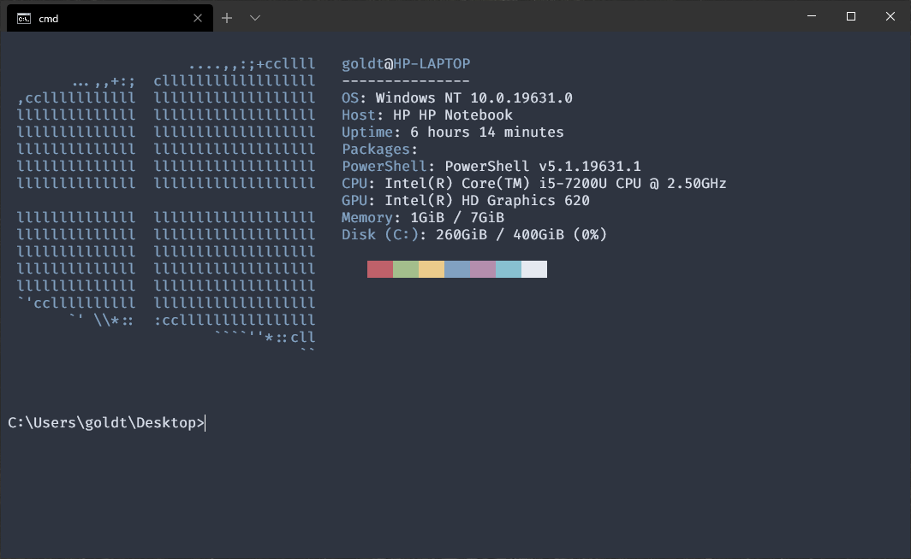

> Details: [Nord](themes/nord.md)  
> Reference: https://github.com/arcticicestudio/nord/issues/123

### Dracula

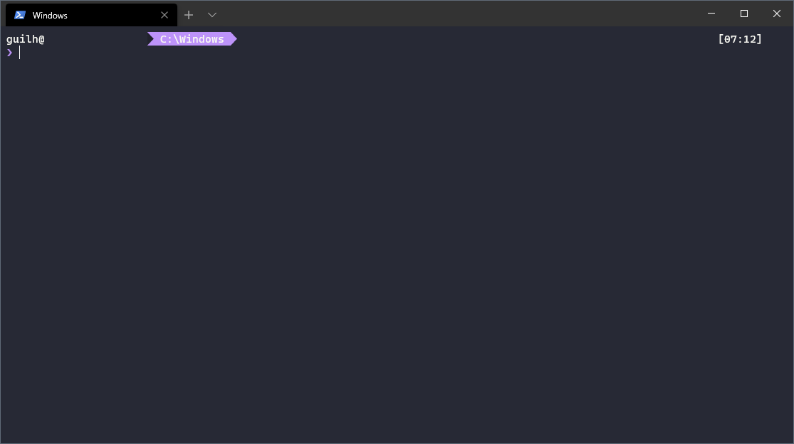

> Details: [Dracula](themes/dracula.md)  
> Reference: https://draculatheme.com/windows-terminal

### Ayu

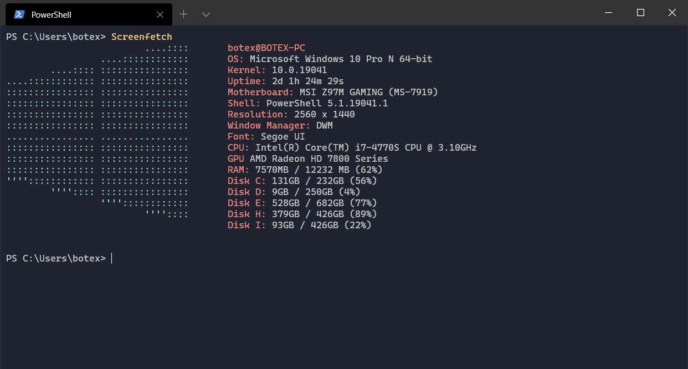

> Details: [Ayu](themes/ayu.md)  
> Reference: https://gist.github.com/joshtynjala/10dbdd4e449027fe9723b1d9f553c0bd

### Beaufort

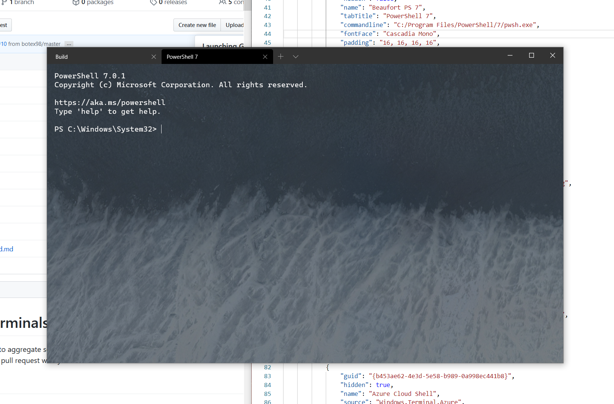

> Details: [Beaufort](themes/beaufort.md)

### Nando's

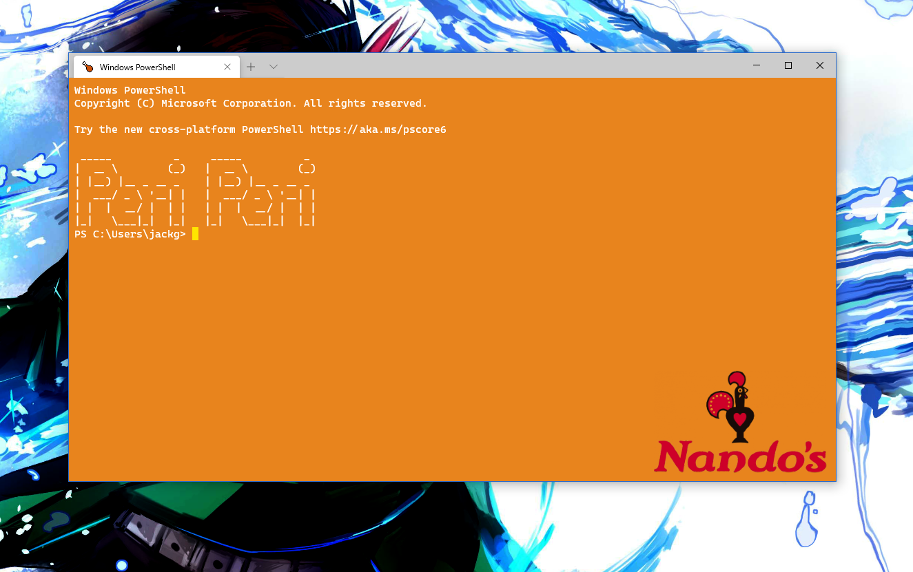

> Details: [Nando's](themes/nandos.md)  
> Reference: https://github.com/AwesomeJackify/Nandos-Terminal-Theme

### Dunder Mifflin Inc

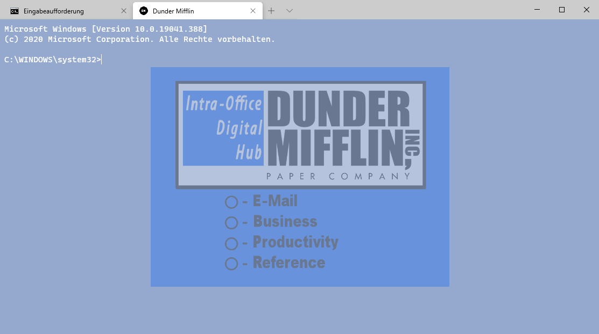

> Details: [Dunder Mifflin](themes/dunder-mifflin.md)  
> Reference: https://github.com/Archerymaister/windows-terminals

### Pure

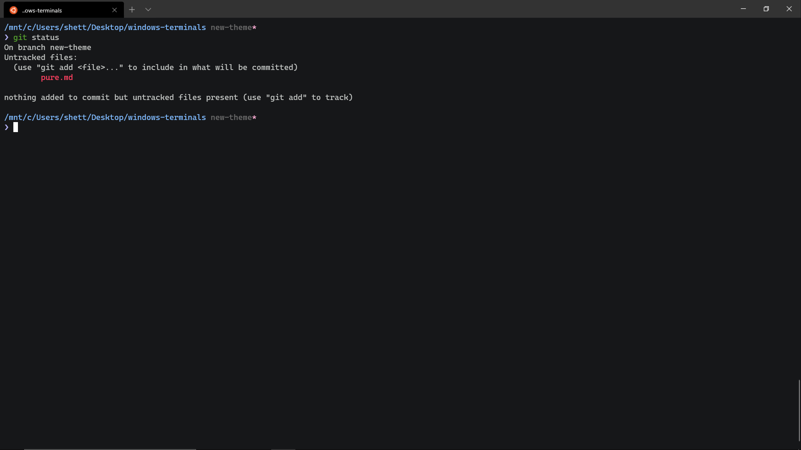

> Details: [Pure](themes/pure.md)

### Plain Powershell | Less is more

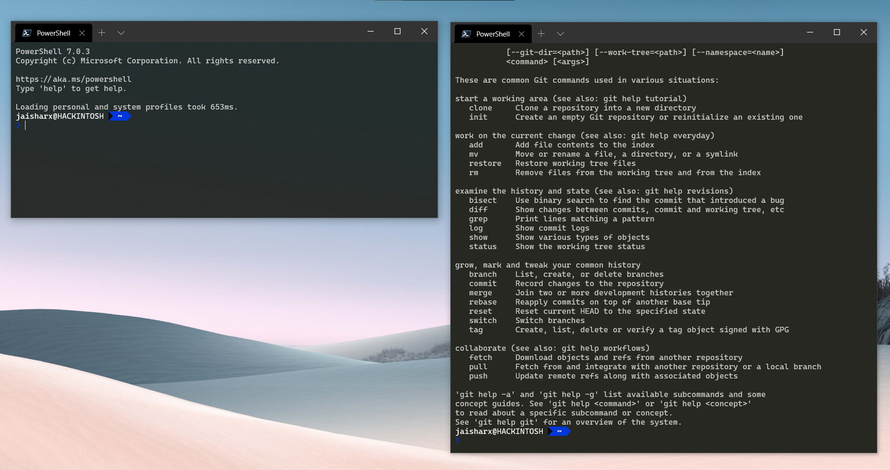

> Details: [Plain Powershell](themes/PPowershell.md)

### Argonaut

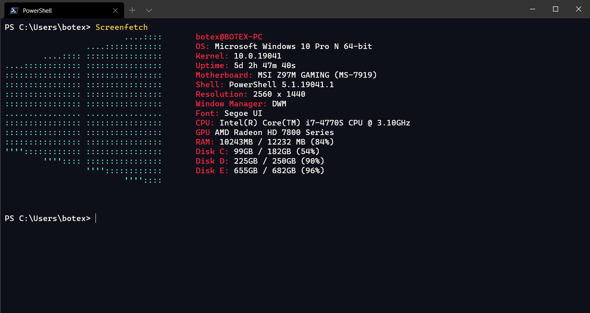

> Details: [Argonaut](themes/Argonaut.md)

### Star Wars

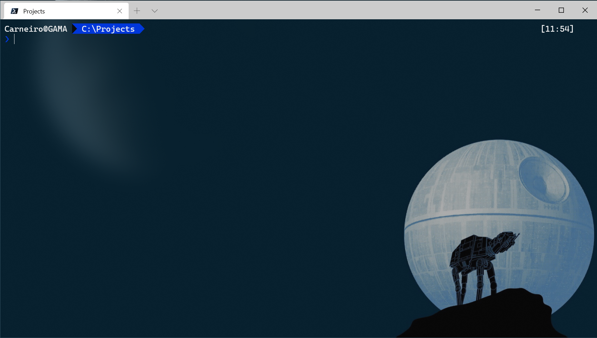

> Details: [Star Wars](themes/Star-Wars.md)

### retrowave


> Details: [retrowave](themes/retrowave.md)  
> Reference: https://blog.netnerds.net/2020/07/my-windows-terminal-retro-theme/
