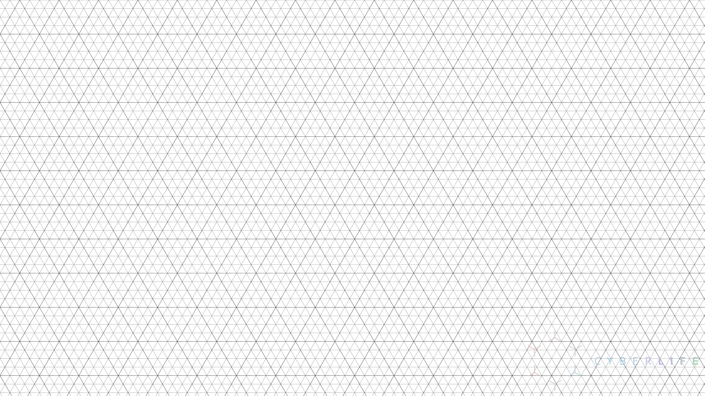
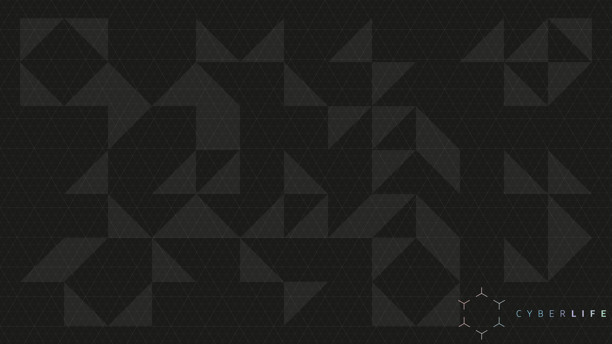

# Detroit Become Human


## Settings

```json
{
    "name": "Cyberlife",
    "hidden": false,
    "tabTitle": "Cyberlife Industries",
    "colorScheme" : "Cyberlife",
    "backgroundImage": "ms-appdata:///roaming/Cyberlife_console_background.png",
    "icon" : "ms-appdata:///roaming/LED_-_Detroit.png",
    "cursorShape": "filledBox",
    "cursorColor" : "#6AE4F1",
    "experimental.retroTerminalEffect": true,
    "acrylicOpacity": 0.8,
    "backgroundImageOpacity": 0.6
}
```

## Fonts

n/a

## Background






## Color Scheme

```json
{
    "name": "Cyberlife",
    "background": "#1a1a18",
    "black": "#928C80",
    "blue": "#78D6F2",
    "brightBlack": "#A0A0A0",
    "brightBlue": "#6DDDF1",
    "brightCyan": "#90E6BF",
    "brightGreen": "#B9E293",
    "brightPurple": "#6369DB",
    "brightRed": "#DF806E",
    "brightWhite": "#FBFCFF",
    "brightYellow": "#E2D07A",
    "cyan": "#BCE5D2",
    "foreground": "#6AE4F1",
    "green": "#78E05E",
    "purple": "#565BBC",
    "red": "#DD563E",
    "white": "#FFFFFF",
    "yellow": "#F9FF4C"
}
```
