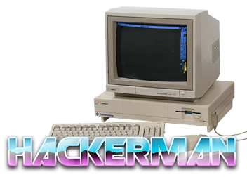

# Hackerman


## Settings

```json
{
    "colorScheme": "One Half Dark",
    "useAcrylic": true,
    "acrylicOpacity": 0.4,
    "backgroundImage": "ms-appdata:///roaming/xNmzL9d.png",
    "backgroundImageStretchMode": "none",
    "backgroundImageAlignment": "bottomRight",
    "backgroundImageOpacity": 0.8,
    "cursorColor" : "#00FF21"
}
```

## Fonts

n/a

## Background



## Color Scheme

```json
{
    "name": "One Half Dark",
    "background": "#171B1F"
}
```
