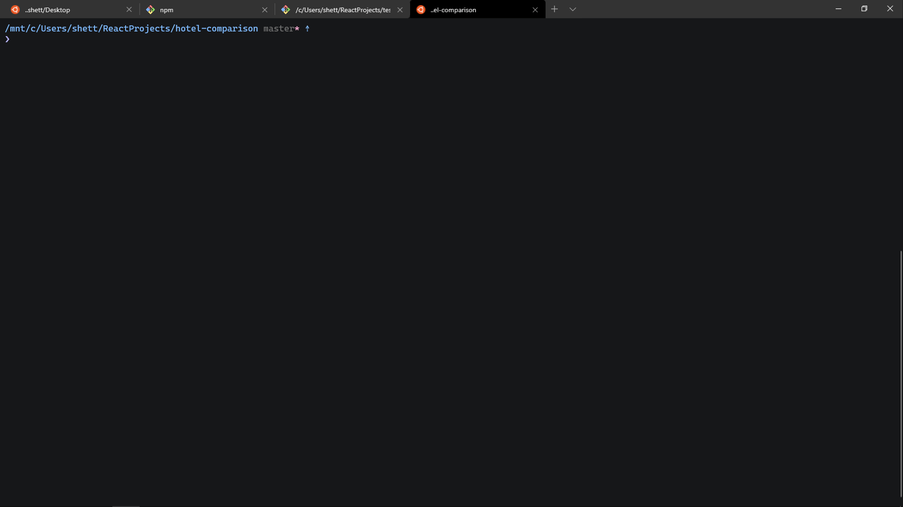

# Pure



## Settings

```json
{
  "hidden": false,
  "name": "Ubuntu-20.04",
  "colorScheme": "Atom",
  "source": "Windows.Terminal.Wsl",
  "fontFace": "Cascadia Code",
  "cursorShape": "filledBox",
  "icon": "C:\\Program Files\\Git\\mingw64\\share\\git\\ubuntu.ico"
}
```

## Fonts

- Cascadia Code

## Background

N/A

## Icon


## Color Scheme

```json
{
  "name": "Atom",
  "black": "#000000",
  "red": "#ff4060",
  "green": "#55a12d",
  "yellow": "#ffd7b1",
  "blue": "#80bbff",
  "purple": "#b9b6fc",
  "cyan": "#85befd",
  "white": "#e0e0e0",
  "brightBlack": "#444444",
  "brightRed": "#ff4060",
  "brightGreen": "#94fa36",
  "brightYellow": "#f5ffa8",
  "brightBlue": "#96cbfe",
  "brightPurple": "#b9b6fc",
  "brightCyan": "#85befd",
  "brightWhite": "#e0e0e0",
  "background": "#161719",
  "foreground": "#c5c8c6"
}
```
