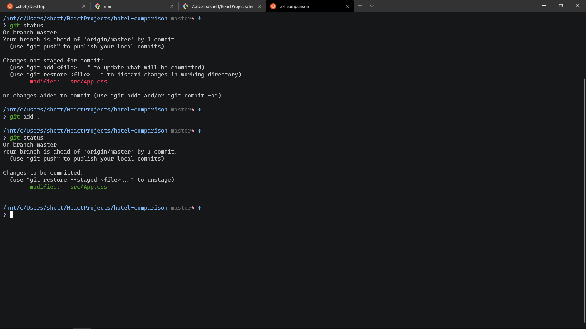

#Pure
###Theme setup - Zsh shell, oh-my-zsh with pure theme and Terminal with Atom color scheme



## Fonts

- Cascadia Mono

## Background

n/a

## Color Scheme

```json
{
  "name": "Atom",
  "black": "#000000",
  "red": "#ff4060",
  "green": "#55a12d",
  "yellow": "#ffd7b1",
  "blue": "#80bbff",
  "purple": "#b9b6fc",
  "cyan": "#85befd",
  "white": "#e0e0e0",
  "brightBlack": "#444444",
  "brightRed": "#ff4060",
  "brightGreen": "#94fa36",
  "brightYellow": "#f5ffa8",
  "brightBlue": "#96cbfe",
  "brightPurple": "#b9b6fc",
  "brightCyan": "#85befd",
  "brightWhite": "#e0e0e0",
  "background": "#161719",
  "foreground": "#c5c8c6"
}
```
