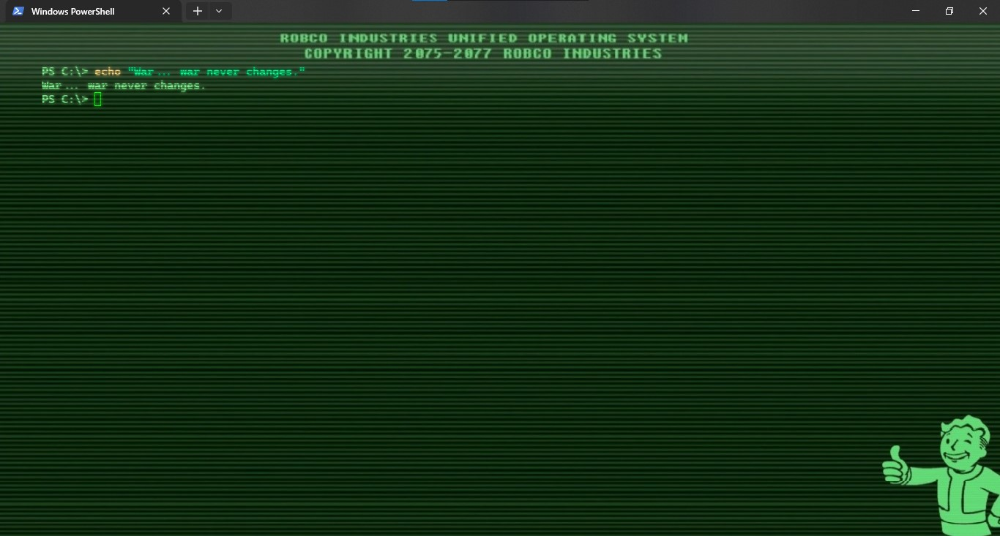
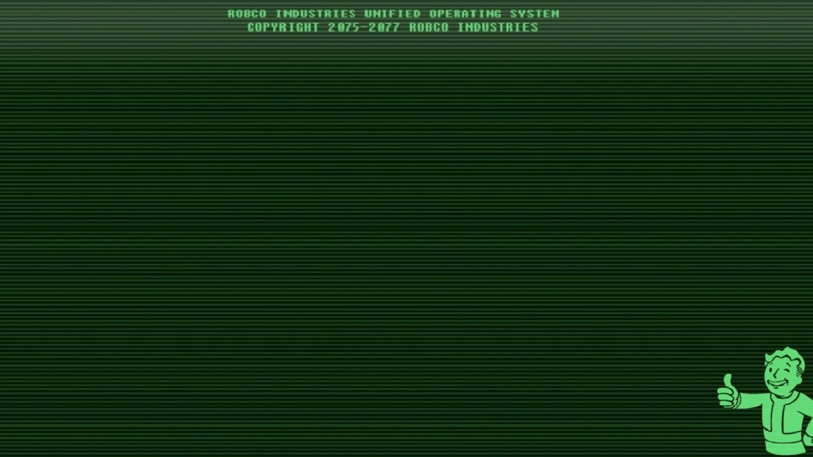

# Fallout PipBoy



## Settings

```json
{
    "adjustIndistinguishableColors": "always",
    "backgroundImage": "ms-appdata:///roaming/Fallout_PipBoy.jpg",
    "backgroundImageStretchMode": "fill",
    "colorScheme": "GreenMonochrome",
    "cursorShape": "emptyBox",
    "experimental.retroTerminalEffect": true,
    "font": 
    {
        "face": "Cascadia Code",
        "weight": "bold"
    },
    "intenseTextStyle": "none",
    "padding": "57",
    "scrollbarState": "visible",
    "useAcrylic": true
}
```

## Fonts

n/a

## Background



## Color Scheme

```json
        {
            "name": "Fallout PipBoy",
            "background": "#000000",
            "black": "#000000",
            "blue": "#2C83FF",
            "brightBlack": "#003300",
            "brightBlue": "#1D55A6",
            "brightCyan": "#4DFFB8",
            "brightGreen": "#32CD32",
            "brightPurple": "#20755E",
            "brightRed": "#5BFF00",
            "brightWhite": "#99FF99",
            "brightYellow": "#8F7C48",
            "cursorColor": "#00FF00",
            "cyan": "#009151",
            "foreground": "#4D9154",
            "green": "#09A600",
            "purple": "#701D43",
            "red": "#3B3A23",
            "selectionBackground": "#415441",
            "white": "#59FF59",
            "yellow": "#8F7500"
        }
```
