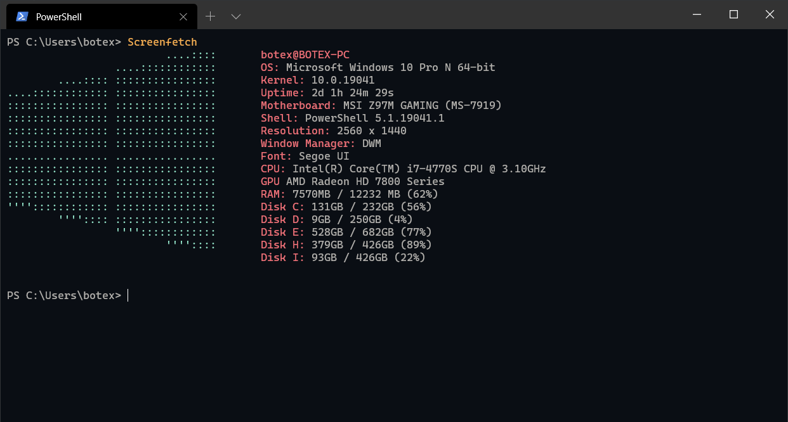

# Ayu Themes





## Settings

```json
{
    "colorScheme": "Ayu Mirage"
}
```

## Fonts

- Cascadia Mono

## Background

n/a

## Color Scheme

```json
{
    "name" : "Ayu Light",
    "background" : "#fafafa",
    "black" : "#000000",
    "blue" : "#3199e1",
    "brightBlack" : "#686868",
    "brightBlue" : "#399ee6",
    "brightCyan" : "#4cbf99",
    "brightGreen" : "#86b300",
    "brightPurple" : "#a37acc",
    "brightRed" : "#f07171",
    "brightWhite" : "#d1d1d1",
    "brightYellow" : "#f2ae49",
    "cyan" : "#46ba94",
    "foreground" : "#6c7680",
    "green" : "#99bf4d",
    "purple" : "#9e75c7",
    "red" : "#ea6c6d",
    "white" : "#c7c7c7",
    "yellow" : "#eca944"
},
{
    "name" : "Ayu Dark",
    "background" : "#0a0e14",
    "black" : "#01060e",
    "blue" : "#53bdfa",
    "brightBlack" : "#686868",
    "brightBlue" : "#59c2ff",
    "brightCyan" : "#95e6cb",
    "brightGreen" : "#c2d94c",
    "brightPurple" : "#ffee99",
    "brightRed" : "#f07178",
    "brightWhite" : "#ffffff",
    "brightYellow" : "#ffb454",
    "cyan" : "#90e1c6",
    "foreground" : "#b3b1ad",
    "green" : "#91b362",
    "purple" : "#fae994",
    "red" : "#ea6c73",
    "white" : "#c7c7c7",
    "yellow" : "#f9af4f"
},
{
    "name" : "Ayu Mirage",
    "background" : "#1f2430",
    "black" : "#191e2a",
    "blue" : "#6dcbfa",
    "brightBlack" : "#686868",
    "brightBlue" : "#73d0ff",
    "brightCyan" : "#95e6cb",
    "brightGreen" : "#bae67e",
    "brightPurple" : "#d4bfff",
    "brightRed" : "#f28779",
    "brightWhite" : "#ffffff",
    "brightYellow" : "#ffd580",
    "cyan" : "#90e1c6",
    "foreground" : "#cbccc6",
    "green" : "#a6cc70",
    "purple" : "#cfbafa",
    "red" : "#ed8274",
    "white" : "#c7c7c7",
    "yellow" : "#fad07b"
}
```
