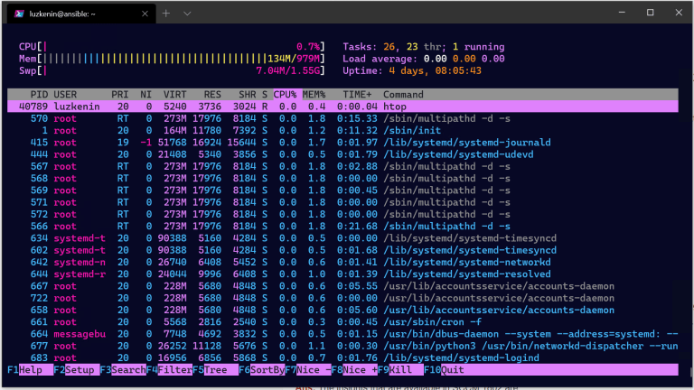

# retrowave



> Reference: https://blog.netnerds.net/2020/07/my-windows-terminal-retro-theme/

## Settings

```json
{
    "colorScheme": "retrowave"
}
```

## Fonts

n/a

## Background

n/a

## Color Scheme

```json
{
    "name" : "retrowave",
    "background" : "#070825",
    "foreground" : "#46BDFF",
    "cyan" : "#df81fc",
    "brightYellow" : "#ffffff",
    "brightBlack" : "#FF16B0",
    "brightGreen" : "#fcee54",
    "green" : "#929292",
    "brightRed" : "#f85353",
    "brightWhite" : "#ffffff",
    "blue" : "#46BDFF",
    "brightBlue" : "#46BDFF",
    "brightCyan" : "#ff901f",
    "brightPurple" : "#FF92DF",
    "purple" : "#FF92DF",
    "red" : "#FF16B0",
    "white" : "#FFFFFF",
    "black" : "#181A1F",
    "yellow" : "#fcee54"
}
```
